# 解决方案书籍

- [《Redis 开发与运维》书籍知识点](./packages/redis%E5%BC%80%E5%8F%91%E4%B8%8E%E8%BF%90%E7%BB%B4//redis%E5%BC%80%E5%8F%91%E4%B8%8E%E8%BF%90%E7%BB%B4.md)
- [《MongoDB 权威指南(第三版)》书籍知识点](<./packages/MongoDB%E6%9D%83%E5%A8%81%E6%8C%87%E5%8D%97/MongoDB%E6%9D%83%E5%A8%81%E6%8C%87%E5%8D%97(%E7%AC%AC%E4%B8%89%E7%89%88).md>)

# node 高级篇代码

> 记录自己学习 node 高级的过程

<br/>

- 01-async-event node 中数据驱动的体验，`EventEmitter`.

<br/>

- 02-single-thread node v8 执行的主线程为单线程，体验单线程在 cpu 堵塞情况下的场景，合理使用 libuv
  库进行异步并发操作！

<br/>

- 03-ts-node-http-server node + ts + express 快速建立 http 服务

<br/>

- 04-node-global node 全局对象/属性

<br/>

- 05-process node process 对象/属性

<br/>

- 06-path path 模块

<br/>

- 🚀07-buffer buffer 对象

<br/>

- 08-buffer fs 模块

<br/>

- 09-md2html md 转 html 利用 path、fs 模块并实现监听写入另一个文件（demo）

<br/>

- 10-open-file fs.open()、fs.write()...方法细节和用途

<br/>

- 11-copy-file 大文件拷贝例子，利用 fs、buffer 等实现，对于大文件可以用流操作会更好，后面会学习...

<br/>

# 《深入浅出 Node.js》笔记、精彩部分

## 第一章 node 简介

- 1.2.2 为什么叫 Node

  > 原文：Node 发展为一个强制不共享任何资源的单线程、单进程系统，包含十分适宜网络的库，为构建大型分
  > 布式应用程序提供基础设施，其目标也是成为一个构建快速、可伸缩的网络应用平台。它自身非常简单，通过
  > 通信协议来组织许多 Node，非常容易通过扩展来达成构建大型网络应用的目的。每一个 Node 进程都构成这
  > 个网络应用中的一个节点，这是它名字所含意义的真谛。

  此乃 Node.js 真谛，在前十年创造出来就被赋予的使命，"分布式架构"、"落地微服务"！

- 第一章讲了 node 的历史、node 被赋予的使命、node 的强势点、node 适用于什么样的应用场景、node 异步编
  程的特性、以及 V8 单线程和 node 的 child_process 简介...

## 第二章 模块机制

- 2.1.1 Node 与浏览器以及 W3C 组织、CommonJS 组织、ECMAScript 之间的关系
  
  > 2022-05-19，目前 EcmaScript 提出的 ESModule 规范被 Nodejs 采纳，ES 规范肯定要更加标准
  > ！TypeScript 在用 ESModule，Node v1x 以`.mjs`为文件后缀执行 ESModule，普通 js 或`.cjs`执行
  > CommonJs 规范，但是不能混用！或`package.json`文件修改`module`属性,更多详细查看 node 官方文档！

<br>

### 2.2🥕CommonJS 模块加载机制

- node 中引入模块经历 3 个步骤：

  1. 路径分析
  2. 文件定位
  3. 编译执行

- 路径分析：`模块标识符`在 Node 中主要分为以下几类

  - 核心模块，如`http`、`fs`、`path`等...
  - `"."`或`".."`开始的相对路径文件模块
  - `"/"`开始的绝对路径文件模块
  - 非路径形式的`node_modules内的文件模块`，如自定义的 connect 模块。

- 文件定位：

  - 扩展名：可以忽略不写，cjs 会按.js、.json、.node 的次序补足扩展名

    > require()过程需要调用 fs 模块同步阻塞式地判断文件是否存在。 <u>**注意**</u>：最好写完整的扩展
    > 名，可提升效率

  - 目录分析和包：如果没查到文件但查到目录，Node 在当前目录下；查找到`package.json`解析出"main"字段
    ，如果缺少扩展名，会再次进入扩展名分析步骤；未查到`package.json`依次查找
    index.js、index.json、index.node 未找到，递归上层 node_modules 包，都为查到，报错！

- 编译执行：

  - js 文件：通过 fs 模块同步读取文件后编译执行

  - node 文件：这是用 C/C++编写的扩展文件，通过 dlopen()方法加载最后编译生成的文件。

  - json 文件：通过 fs 模块同步读取文件后，用 JSON.parse()解析返回结果。

  - 其余扩展名：它们都被当做.js 文件载入。

    > <u>**注意**</u>：每一个编译成功的模块都会将其文件路径作为索引缓存在 Module.\_cache 对象上，以
    > 提高二 次引入的性能。

- node 模块分两类：

  - 🥕**核心模块**：node 源码编译成了二进制文件执行文件，启动时会被直接加载进内存！所以这部分模块引
    入时没有`文件定位`、`编译执行`两个操作！并且在`路径分析`中优先判断！所以加载速度最快

    > <u>**注意**</u>：核心模块加载优先级仅次于缓存加载

  - 文件模块：用户编写；运行时动态加载，会经过完整的引入模块的三个步骤，速度慢于核心模块

    > 1. 路径形式的文件模块：`"."、".."、"/"`开头的路径会解析成真实路径作为索引，加载慢于核心模块加
    >    载
    >
    > 2. 自定义模块：查找`node_modules`文件数组，以当前目录的 node_modules 开始往父级 node_modules
    >    递归向上查找。加载速度最慢！ <u>**注意**</u>：层级越深查找越慢！这就是为什么加载速度最慢的
    >    原因！
    >
    >    ```js
    >    console.log(module.paths);
    >    // 结果
    >    [
    >      "/Users/xiaoqinvar/Desktop/practice/node高级/packages/node_modules",
    >      "/Users/xiaoqinvar/Desktop/practice/node高级/node_modules",
    >      "/Users/xiaoqinvar/Desktop/practice/node_modules",
    >      "/Users/xiaoqinvar/Desktop/node_modules",
    >      "/Users/xiaoqinvar/node_modules",
    >      "/Users/node_modules",
    >      "/node_modules",
    >    ];
    >    ```

- 🥕**优先从缓存加载**

  > 1. 与浏览器缓存机制类似，Node 对引入过的模块都会进行缓存，以减少二次引入时的开销。不同的地方在于
  >    ，浏览器仅仅缓存文件，而**Node 会缓存的是编译和执行之后的对象**。
  >
  > 2. 不论是`核心模块`还是`文件模块`，require()方法对相同模块的二次加载都一律采用缓存优先的方式，这
  >    是**第一优先级**的。不同之处在于核心模块的缓存检查优先文件模块的缓存检查

- 编译过程： Node 对获取的 JavaScript 文件内容进行了头尾包装。

  ```js
  (function (exports, require, module, __filename, __dirname) {
    // 我们的代码部分
    var math = require("math");
    exports.area = function (radius) {
      return Math.PI * radius * radius;
    };
    // 我们的代码部分结束
  });
  ```

  > 包装之后的代码会通过`vm原生模块`的 runInThisContext()方法执行（类似 eval，只是具有明确上下文，不
  > 污染全局），返回一个具体的 function 对象。最后，将当前模块对象的 exports 属性、require()方法
  > 、module（模块对象自身），以及在文件定位中得到的完整文件路径和文件目录作为参数传递给这个
  > function()执行。

  ```js
  // 2.2.3.export.cjs
  const user = {
    name: "xiaoqinvar",
  };

  // module.exports = user; // { name: 'xiaoqinvar' }
  // exports = user; // {}
  exports.user = user; // // { name: 'xiaoqinvar' }

  // 2.2.3.import.cjs
  const fileExport = require("./2.2.3.export.cjs");
  console.log(fileExport);
  ```

  > 用 exports 证明确实包装过，exports 直接赋值相当于将形参的指针指向了 user 对象，而不在是
  > module.exports，而导出的是 module.exports，此时 module.export 为空，自然接受的是个空对象！

- C/C++模块编译

  > 无需编译过程，只有加载和执行过程，执行方面高于 Js

- JSON 文件编译

  > 此方式最简单，Node 利用 fs 模块同步读取 JSON 文件的内容之 后，调用 JSON.parse()方法得到对象，然
  > 后将它赋给模块对象的 exports，以供外部调用，第一次加载会缓存！ <u>注意</u>：如果你要加载 json 文
  > 件直接 require()，而不是 fs 读取，require()会缓存

### 核心模块加载过程

- C/C++核心模块运行

> C/C++编写，**性能上优于脚本语言**；它们是被编译的二进制文件。**一旦 Node 开始执行，它们被直接加载
> 进内存中**，无须再次做标识符定位、文件定位、编译等过程，直接就可执行

- javascript 转存 c/c++过程

  启动时：Node 采用了 V8 附带的 js2c.py 工具，将所有内置的 JavaScript 代码（src/node.js 和
  lib/\*.js）生成 node_natives.h 头文件，此过程**js 代码以字符串的形式存储在 node 命名空间中**，是不
  可直接执行的。

  启动 Node 进程时：JavaScript 代码直接加载进内存中。所以核心模块加载比文件模块从磁盘中一处一处查找
  要快很多。

- 挂载 javascript 核心模块

  > 源文件通过 process.binding('natives')取出，编译成功的核心模块缓存到 NativeModule.\_cache 对象上
  > ，文件模块则缓存到 Module.\_cache 对象上

### 加载过程图解


### 加载顺序图解


### cjs 和 esm 的区别


## 第三章 异步 IO

- 在 Node 中，无论是\*nix 还是 Windows 平台，内部通过 libuv 完成 I/O 任务的另有线程池
  

- event loop 事件轮训流程图
  

- 在 Node 中，事件主要来源于网络请求、文件 I/O 等，这些事件对应的观察者
  有`文件I/O观察者`、`网络I/O观察者`...,对不同事件进行分类

- 事件循环是一个典型的`生产者/消费者模型`;

  - 生产者：异步 I/O、网络请求事件等
  - 消费者：事件完成后被传递到对应的观察者那里，事件循环则从观察者那里取出事件并执行回调函数

- `process.nextTick()`存入一个数组，每次事件循环执行数组内所有，而`setImmediate`存放在链表中，每次事
  件循环只执行其中一个(按先后顺序)

```js
// 加入两个nextTick()的回调函数
process.nextTick(() => console.log('nextTick延迟执行1'));
process.nextTick(() => console.log('nextTick延迟执行2'));
// 加入两个setImmediate()的回调函数
setImmediate(function () {
 console.log('setImmediate延迟执行1');
 // 进入下次循环
 process.nextTick(process.nextTick(() => console.log('强势插入')););
});
setImmediate(function () {
 console.log('setImmediate延迟执行2');
});

// 结果
nextTick延迟执行1
nextTick延迟执行2
setImmediate延迟执行1
强势插入
setImmediate延迟执行2
```

> 之所以这样设计，是为了保证每轮循环能够较快地执行结束，防止 CPU 占用过多而阻塞后续 I/O 调用的情况

- 异步 i/o，事件循环总结图
  

<br>

## 第四章 异步编程

> 浏览器提出了`Web Workers`，它通过将`JavaScript执行`与`UI`渲染分离，可以很好地利用多核 CPU 为大量计
> 算服务。同时前端`WebWorkers`也是一个利用消息机制合理使用多核 CPU 的理想模型。

- 中间件 
  > `next()`流程控制

<br>

## 第五章 内存控制

### 内存限制

- 内存限制：64 位系统下约为 1.4GB，32 位系统下约为 0.7GB

  ```js
  const memory = process.memoryUsage();
  console.log(memory);
  console.log('v8目前已申请到的内存大小', memory.heapTotal / 1024 / 1024, 'M');
  console.log('v8目前已使用到的内存大小', memory.heapUsed / 1024 / 1024, 'M');

  // 结果
  {
    rss: 26427392,
    heapTotal: 5529600, // 已申请到的堆内存
    heapUsed: 2695064, // 已申请到的堆内存的使用量
    external: 912267,
    arrayBuffers: 10803
  }
  v8目前已申请到的内存大小 5.2734375 M
  v8目前已使用到的内存大小 2.5702133178710938 M
  ```

  > ⚠️ 如果已申请的堆空闲 内存不够分配新的对象，将继续申请堆内存，直到堆的大小超过 V8 的限制为止!

  官方的说法，以 1.5GB 的垃圾回收堆内存为例，V8 做一次小的垃圾回收需要 50 毫秒以上，做一次非增量式的
  垃圾回收甚至要 1 秒以上。这是**垃圾回收引起 JavaScript 线程暂停执行**的时间，在这样的时间花销下，
  应用的性能和响应能力都会直线下降。这样的情况不仅仅后端服务无法接受，前端浏览器也无法接受。因此，在
  当时的考虑下直接限制堆内存是一个好的选择。

  > `总结`：v8 单线程原因，垃圾回收时 js 无法执行，**大量垃圾回收占用时间导致 js 代码长期无法继续执
  > 行**，v8 限制内存可谓是一个好的选择！

### 开启自定义内存

```js
node --max-old-space-size=1700 test.js // 设置老生代内存空间的最大值，单位为MB
// 或者
node --max-new-space-size=1024 test.js // 设置新生代内存空间的最大值，单位为KB
```

> 一旦生效就不能再动态改变

### 垃圾回收机制


- 垃圾回收新生代算法：Scavenge 算法


`缺点`：空间换时间的算法 From 中存活的对象全部复制到 To，清空 From 内存，To-From 角色互换

- From -> To，未经历过复制，复制到 To 空间，否则晋升到老生代
- From -> To，To 空间占用到 25%，晋升到老生代

> 阈值 25%因为如果占比过高，会影响后续的内存分配因为活着的对象占少数，所以只复制活着的

- 垃圾回收老生代算法：

  - Mark-Sweep(标记扫除)

    Mark-Sweep 在标记阶段遍历堆中的所有对象，并标记活着的对象，在随后的清除阶段中，只清除没有被标记
    的对象。 `缺点`：扫除的内存可能是分段式的，如果要放入一个大对象可能无法都无法满足，会提前触发垃
    圾回收

    > 因为死亡的对象占少数，所以只清除死亡的

  - Mark-Compact(标记压缩) 基于 Mark-Sweep，但是会在整理的 过程中，将活着的对象往一端移动，移动完成
    后，直接清理掉边界外的内存 `缺点`:比 Mark-Sweep 更加耗时，是一种时间换空间的做法

  > V8 对于老生代采用的垃圾回收策略是：主要使用 Mark-Sweep，在空间不足以对从新生代中晋升过来的对象进
  > 行分配时才使用 Mark-Compact


- v8 真实回收方式：垃圾回收的 3 种基本算法都需要将应用逻辑暂停下来，待执行完垃圾回收后再恢复执行应用
  逻辑。

  - `新生代垃圾回收`：只收集新生代，由于新生代默认配置得较小，且其中存活对象通常较少，所以即便它是全
    停顿的影响也不大，称之为` 全停顿`。
  - `老生代垃圾回收`：内存配置大，`全停顿`不再适合，而是用`增量标记`，拆分为许多小“步进”，每做完一“
    步进”就让 JavaScript 应用逻辑执行一小会儿，垃圾回收与应用逻辑交替执行直到标记阶段完成。


> V8 后续还引入了延迟清理（lazy sweeping）与增量式整理（incremental compaction），让清理与整理动作也
> 变成增量式的“步进”交替方式。同时还计划引入并行标记与并行清理，进一步利用多核性能降低每次停顿的时间
> 。

### 常驻内存

- 进程内存 = rss(包括 arrayBuffers) + 交换区(swap) + 文件系统(file system)
- ⚠️ Buffer 不在 v8 管理的内存中，在常驻内存中，但是受 V8 垃圾回收管制
- `Buffer.alloc()`从内存中创建，`Buffer.unsafe()`从`arrayBuffers`中创建，超出`arrayBuffer / 2`时会从
  内存中创建
- 详细查看：http://nodejs.cn/api-v14/buffer.html#static-method-bufferallocunsafesize
- node 内存图 

### 避免内存缓存

- 缓存

  1. 不要让对象做缓存，不要让对象无限增加

  2. 模块化导入模块不要对其进行添加值的操作，或者值记得清空，不要让他无限增长，因为它会在 V8 老生代
     中常留

  3. 进程间通信缓存是无法共享的，两个进程之间都有缓存很可能缓存的内容一致，这是一种对内存的浪费

- 队列

  1. 生产者-消费者模型中，如果生产者速度 > 消费者速度，会造成产物堆积。解决方案：设定生产边界值，提
     升消费者速度技术，生产、消费超时拒绝异常等

- 缓存方案：
  1. redis ✅
  2. Memcached

## Buffer

## 🥕Buffer 分配

- ⚠️ Buffer 以 8KB 划分大内存对象和小内存对象，称之为 slab 分配机制，以它作为单位单元分配。

  ```js
  console.log("buffer 池大小", Buffer.poolSize / 1024 + "KB");
  // buffer 池大小 8KB
  Buffer.poolSize; // 初始化Buffer池的大小单位字节，可以修改
  ```

- 分配小对象(<= 8KB)

  构造小 Buffer 对象时，会去检查 pool 对象，如果 pool 没有被创建，将会创建一个新的 slab 单元指向它，
  并记录分配了多大。

  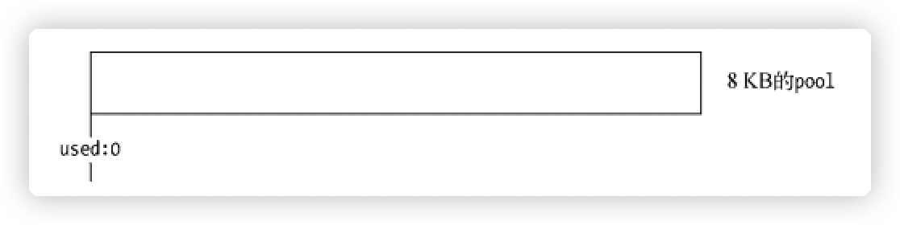

  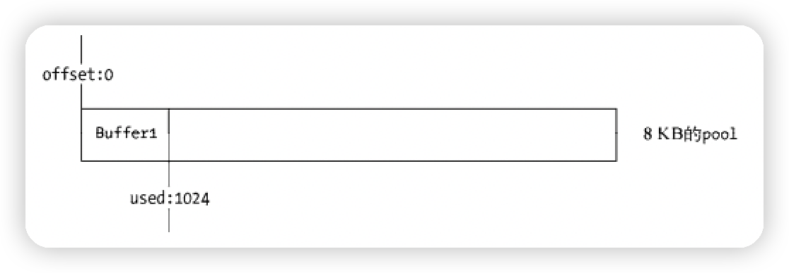

  ⚠️ 注意：如果在有 1KB 小对象的情况下，再次插入 7.5KB 的对象，因为没有足够的空间所以需要再开辟一个
  slab(8KB 内存) ♻️ 回收：只要有一个 slab 内的小对象存活，那么这块 slab 就无法回收！

- 分配大对象(>= 8KB)

  如果需要超过 8KB 的 Buffer 对象，将会直接分配一个 SlowBuffer 对象作为 slab 单元，该调用属于 node
  调用 c++层面 (⚠️ 不推荐直接使用 SlowBuffer，直接调用 C++层面的 Buffer 不会被 V8 标记，无法有效的进
  行垃圾回收)

> ⚠️ 以上 Buffer 创建都会被 V8 垃圾回收标记的，所以 V8 垃圾回收也会处理 Buffer 垃圾

## 网络编程

- TCP 三次握手

  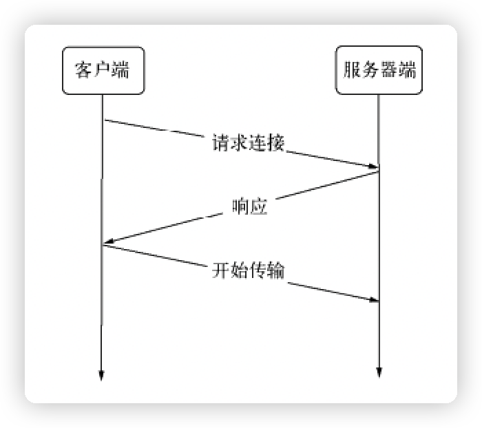

  - http 请求流程 http 执行流程：在请求产生的过程中，http 模块拿到连接中传来的数据，调用二进制模块
    http_parser 进行解析，在解析完请求报文的报头后，触发 request 事件，调用用户的业务逻辑
    

* websocket 握手流程 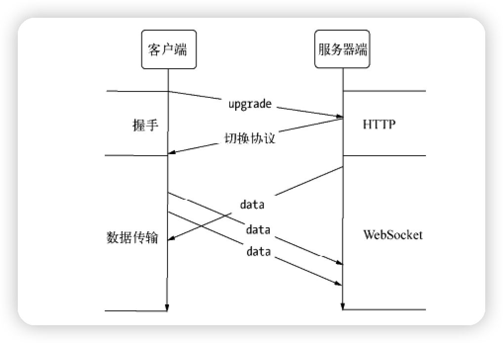

* websocket 数据帧 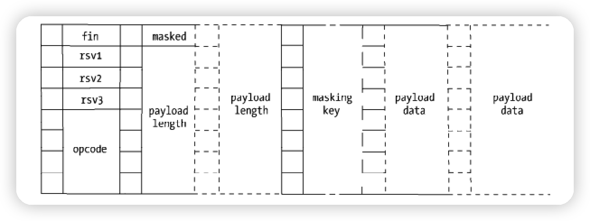

* TLS/SSL 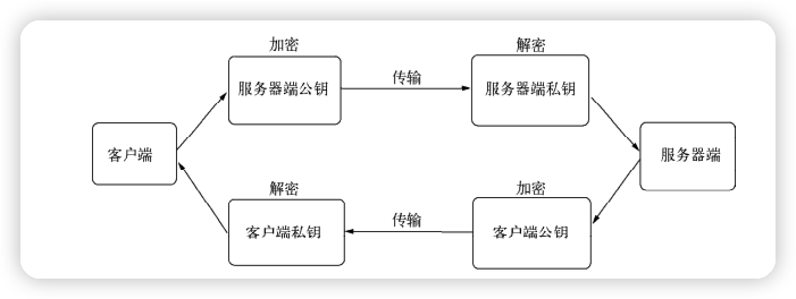

## web 应用构建

- 浏览器缓存 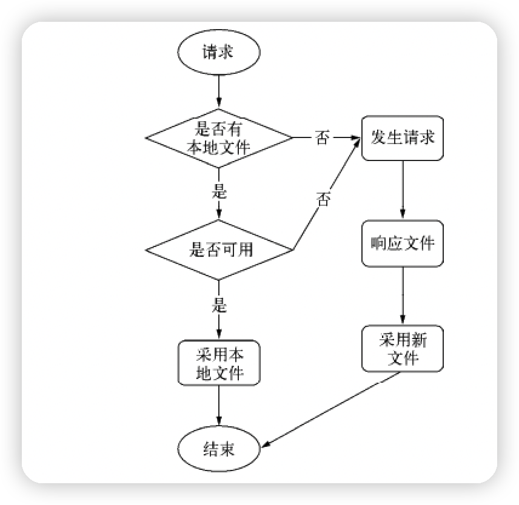

## 多进程

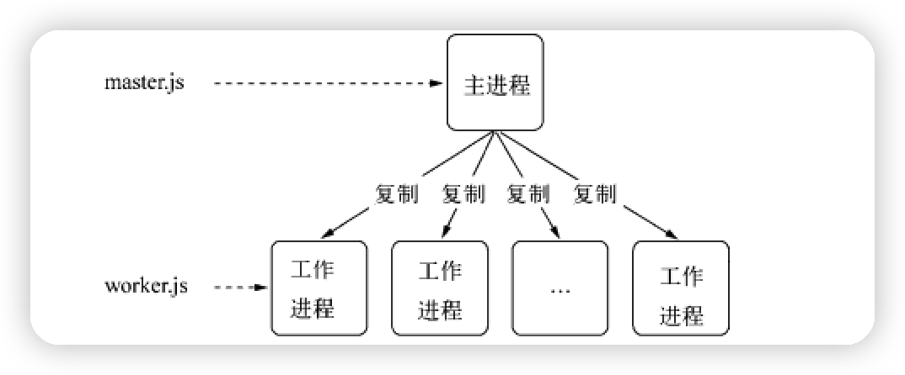

- 多进程通信原理 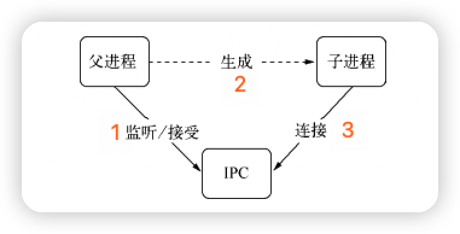

- 多子进程占用一个端口 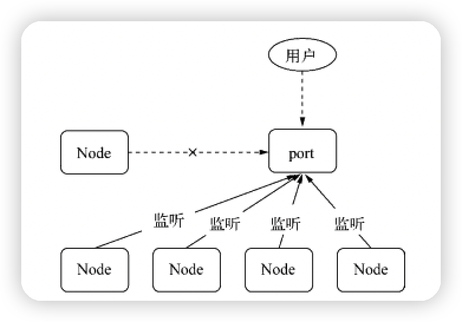

- 父子进程通信，平滑重启、自杀信号
  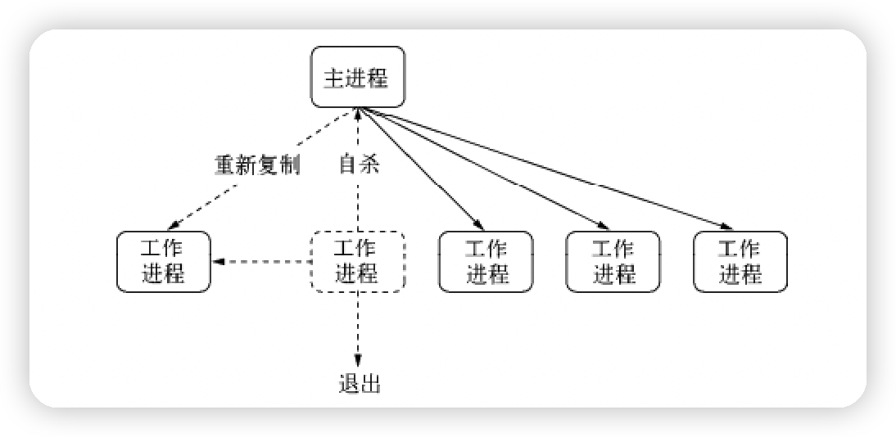

- cluster 模块就是对 child_process 模块对封装，更简单，更健壮，更安全
  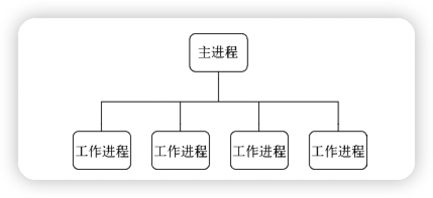
