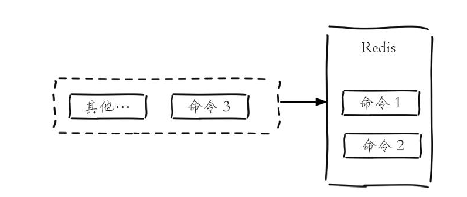
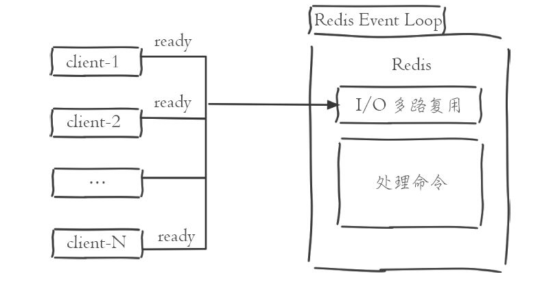
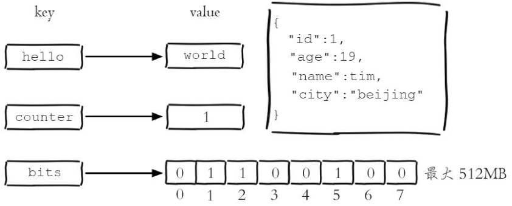
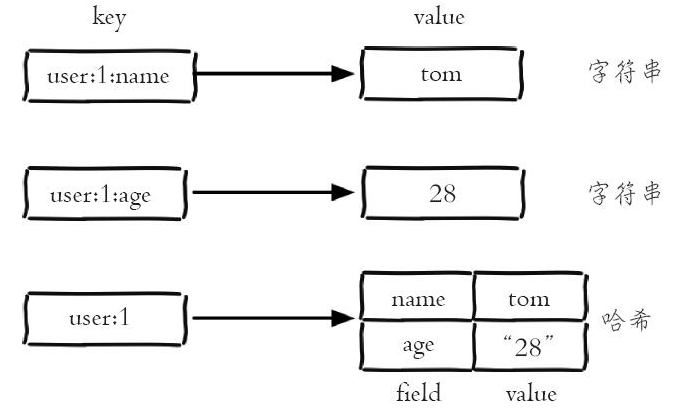
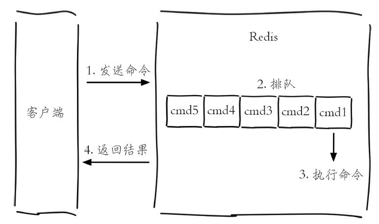

# 《Redis 开发与运维》知识点

## Redis 单线程架构

- **Redis 是`单线程`来处理命令的**，所以一条命令从客户端达到服务端不会立刻被执行，所有命令都会进入一
  个队列中，然后逐个被执行。



- 🥕 为什么 Redis 要使用单线程而不是多线程？
  - 纯`内存`访问，本身访问速度极快，内存的响应时长大约为 100 纳秒
  - `非堵塞I/O`，通过`事件循环`监听网络等事件，像 nodejs 一样执行回调函数
  - 单线程避免了线程切换和竞态产生的消耗
  - 单线程就可以这么高的性能，就没太大必要上多线程了，单线程还**可以简化数据结构和算法的实现**
  - 如果某个**命令执行过长，会造成其他命令的阻塞**，对于 Redis 这种高性能的服务来说是致命的，所以
    Redis 是面向快速执行场景的数据库
    

## Redis 存储类型

### 字符串 string

- 字符串类型的值
  - 简单("world")/复杂字符串('{ "name": "xiaoqinvar" }')
  - 数字(整数、浮点数)
  - 二进制(图片、音视频)

> ⚠️ 限制：最大数据不能超过`512M`



### 字符串操作

```bash
# 								秒级过期		毫秒级过期					key必须不存在(多用于新增) / key必须存在(多用与更新)
set key value [ex seconds] [px milliseconds] [nx|xx]
# 获取值
get key

# 设置秒过期kv
set key seconds value
setex hello 10 aka

# 🥕不存在插入，失败返回false
setnx hello bad

# 存在更新
set hello xqv xx

# 批量新增、批量获取
mset a 1 b 2 c 3 d 4
mget [key ...]

# 追加值
append key value
# 字符串长度
strlen key
# 返回设置成功之前的值
getset key value
getset hello world # 返回(nil)
getset hello redis # 返回"world"
# 替换指定位置的字符
setrange key offeset value
setrange hello 0 h # "world" => "horld"
# 获取部分字符，[start, end)
getrange key start end
setrange hello 0 1 # "world" => "wo"

# 获取内部编码
set key 8653
object encoding key # int
set key "hello,world"
object encoding key # "embstr"
```

> 🥕 setnx 不存在即新增这个特点很适合做分布式锁，官方基于`setnx`分布式锁的实现
> ：[https://redis.io/topics/distlock/](https://redis.io/topics/distlock/)
>
> `mset`批量新增相比依次`set`的好处是可以消耗一次网络 IO，插入多条数据；但是不要批量插入过多，否则会
> 导致`redis执行命令堵塞`或`网络传输堵塞`

```bash
# 自增计数
# 1. 值不是整数，返回错误
# 2. 值是整数，返回自增后的结果。
# 3. 键不存在，按照值为0自增，返回结果为1。
incr key

# 自减
decr key
# 自增指定数字
incrby key increment
# 自减指定数字
decrby key decrement
# 自增浮点数
incrbyfloat key increment
```

> CAS 原子操作本质（自旋锁），多线程里面并行操作用时间换稳定性；Redis 不存在因为单线程！

### hash



- 内部编码
  - `ziplist`（压缩列表）：当哈希类型元素个数小于`hash-max-ziplist-entries`配置（默认 512 个）、同时
    所有值都小于`hash-max-ziplist-value`配置（默认 64 字节）时，Redis 会使用 ziplist 作为哈希的内部
    实现，ziplist 使用更加紧凑的结构实现多个元素的连续存储，所以在节省内存方面比`hashtable`更加优秀
    。
  - `hashtable`（哈希表）：当哈希类型无法满足`ziplist`的条件时，Redis 会使用`hashtable`作为哈希的内
    部实现，因为此时`ziplist`的读写效率会下降，而`hashtable`的读写时间复杂度为 O（1）。

### hash 操作

```bash
# 增删改查
hset key field value
hget key [field...]
hdel key [field...] # 删除个数
key，k_key、k_value:hgetall key
hexists key field # 判断field是否存在，1包含，0不包含
hkeys key # 获取所有field
hvals key # 获取所有value
hgetall key # 获取所有field-value
hlen key # 获取field个数
hstrlen key field # 计算value的字符串长度，"name" => 4

# 批量设置、获取
hmget key [field ...]
hmset key [field value ...]
hmset user:1 name mike age 12 city tianjin
hmget user:1 name city
# "mike"
# "tianjin"

# ⚠️ 如果hash内容较多时，hgetall等获取所有fileds、values、all会造成redis单线程堵塞问题！
# 如果一定要获取全部field-value，可以使用hscan命令，该命令会渐进式遍历哈希类型

# 自增field-value中的value
hincrby key field # 整数
hincrbyfloat key field # 浮点数
```

### list

- 不同元素允许包含相同的 value

- ⚠️ 限制：一个列表最多可以存(2^32)-1 个元素


### 其他类型命令省略

### 数据库命令

- 💡 默认 redis 下有 16 个数据库，数据库之间相互独立，也就是说不同数据库之间可以有相同的键

```bash
# 切换数据库
select dbIndex
# 例子：select 15，最后一个数据库；select 0，第一个数据库
```

> ⚠️ Redis3.0 中已经逐渐弱化 redis 数据库功能，例如 Redis 的分布式实现 Redis Cluster 只允许使用 0 号
> 数据库
>
> - 问题：为什么会弱化 Redis 数据库功能？
> - 答案：Redis 是单线程不同数据库都是使用同一个 CPU；如果堵塞所有数据库都会操作影响，反而**多 redis
>   实例可以通过多进程的方式充分利用 CPU 提升效率降低容错率**

## 慢查询分析



##

# 结合 Lua 脚本

- 执行 lua 脚本

```bash
# redis-cli中执行lua脚本
eval 'return "hello " .. KEYS[1] .. ARGV[1]' 1 redis world
# 返回 -> "hello redisworld"
# KEYS[1] -> redis
# ARGV[1] -> world

# 通过文件执行lua脚本
redis-cli --eval filePath
```

- 发送 lua 脚本并使用`evalsha`执行

```bash
redis-cli script load "$(cat lua_get.lua)"
# 返回-> "7413dc2440db1fea7c0a0bde841fa68eefaf149c"（hash字符串）
evalsha
	7413dc2440db1fea7c0a0bde841fa68eefaf149c
	1 # key个数
	redis # 参数
	world # 参数
# 返回 -> "hello redisworld"
```

- lua 调用 Redis API

```lua
-- lua脚本
-- call()：调用失败会报错，结束执行
-- pcall()：调用失败会忽略错误，继续执行
redis.call("set", "hello", "world")

-- 等价于redis中
eval 'return redis.call("get", KEYS[1])' 1 hello
-- 返回 "world"
```

> 💡 Lua 可以使用 redis.log 函数将日志输出到 Redis 日志中，注意控制日志级别
